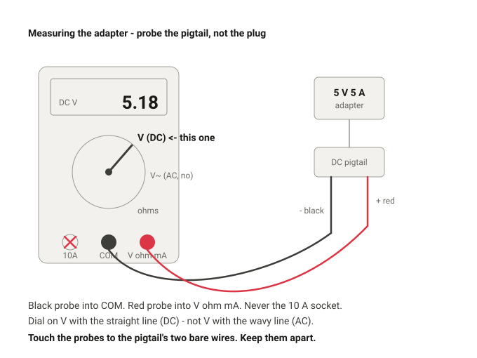
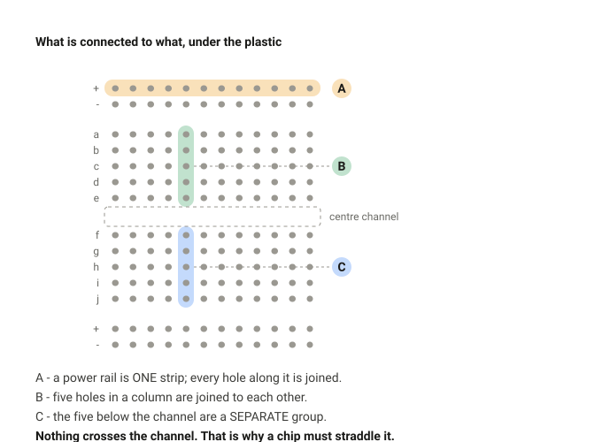
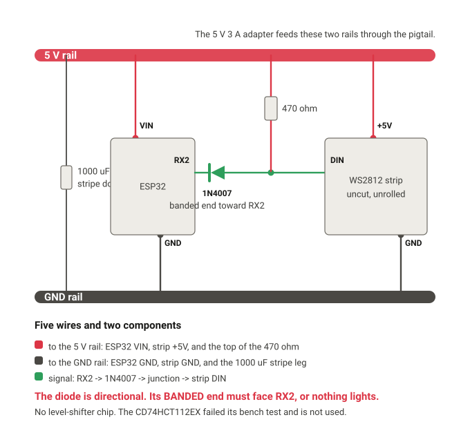
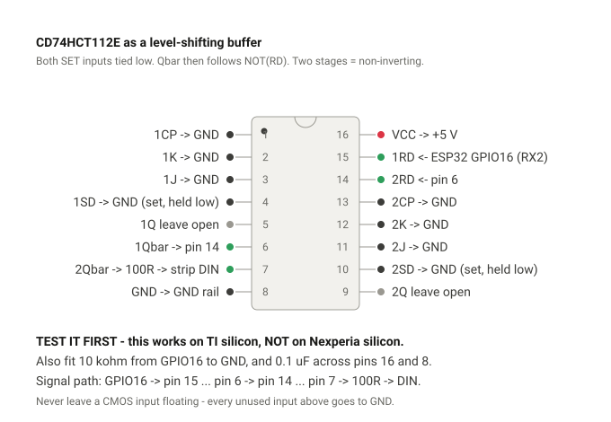
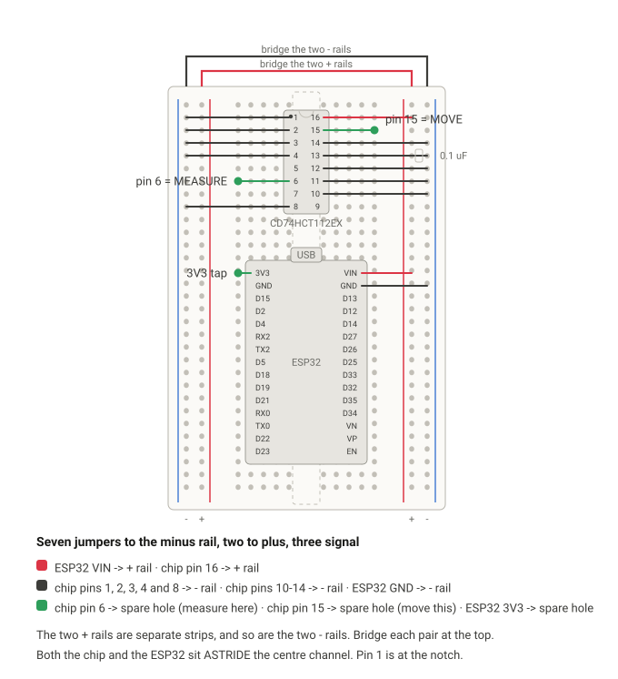
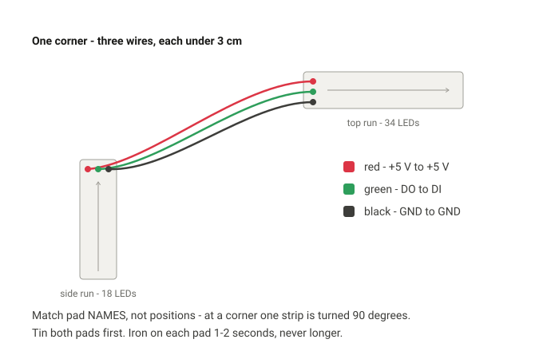

# Building the desk node

Read [PROJECT_STATE.md](PROJECT_STATE.md) first — it says which of these stages
are already done. This file is the whole procedure from the beginning.

Order matters. The strip gets cut and stuck down in Stage 3, which is
irreversible; Stages 1 and 2 prove the electrical and network chain first, on
the uncut strip, where a mistake costs nothing.

---

## Safety, once, for the whole build

> ### THE 12 V ADAPTER WILL DESTROY THIS NODE
>
> Since the Gesto neon strip arrived there are **two adapters on the bench with
> identical 5.5 x 2.1 mm barrel plugs and different voltages**:
>
> | Adapter | For | Barrel |
> |---|---|---|
> | **5 V 3 A** | the ESP32 and the WS2812 strip | 5.5 x 2.1 |
> | **12 V 2 A** (came with the Gesto neon) | the 12 V neon strip ONLY | 5.5 x 2.1 |
>
> They are physically interchangeable and nothing in the circuit stops you.
> **12 V into the 5 V rail instantly kills the ESP32 and every WS2812 on the
> strip** - the ESP32's absolute maximum on VIN is well under 12 V, and the
> LEDs' is 6-7 V. There is no fuse, no reverse protection and no second chance;
> it is one wrong plug and roughly 3,500 rupees of parts.
>
> **Do this before wiring anything:**
>
> 1. **Measure both adapters** with the multimeter. Do not trust the label, and
>    do not trust memory.
> 2. **Write the measured voltage on each brick in marker, on tape**, big
>    enough to read without picking it up.
> 3. **Put the 12 V adapter in a different room, or at least a closed box**,
>    until the desk node is finished. Out of reach beats a label.
>
> The 12 V strip is layer L3/L4 and is not built until the desk node works.
> There is no reason for its adapter to be on the bench at all today.


- **Eye protection at every first power-up.** A 1000 µF electrolytic fitted
  backwards across 5 V heats, vents and can burst. It is the only thing here
  that can actually injure you.
- **Never connect or disconnect the strip while the adapter is on.** If you
  must, the order is ground, then power, then data — and the reverse to
  disconnect.
- **Mate the DC barrel connector before switching on at the wall**, and unplug
  at the wall before unmating. Hot-plugging into 1000 µF draws a multi-amp
  spike for a few hundred microseconds and pits the contacts.
- **Touch a grounded metal object** before handling the strip or the board.
  WS2812s are static-sensitive. Not in socks on synthetic carpet.
- **Unroll the strip before powering it.** A coiled reel cannot shed heat and
  hides a hot spot.
- **Never improvise a mains connection.** Use a proper lead, or use USB.

---

## The strip's ends - RESOLVED 26 Sep 2026

**Both ends already carry wires and a 3-pin connector.** No soldering is needed
to get the strip onto the bench. Confirmed from a photo of the reel.

- Three wires per end: **red, green, white**, into a black 3-pin JST-SM housing.
- Plus a separate pair of flying leads for power injection.

Conventional colour code for this strip type, **to be confirmed against the pad
labels rather than assumed**: red = +5 V, green = DATA, white = GND.

**Which end is DIN:** read the tiny silkscreen where the wires are soldered.
The input end is marked `DI` or `DIN`; the output end `DO` or `DOUT`. The
printed arrows also point *away* from DIN, in the direction data travels.
Do not rely on connector gender - it is not a reliable convention.

## Stage 1 - bench bring-up

### 1.1 Flash WLED - DONE 25 Sep 2026

WLED **16.0.1** is on the board, installed from install.wled.me in Chrome over
USB (Basic mode, Plain variant, adapter unplugged).

> **Do not flash it again.** Everything that remains happens over Wi-Fi.

- The board enumerates as `Silicon Labs CP210x USB to UART Bridge`; on this
  machine it appeared on COM12. Read the chip name, never the COM number.
- The cable is a repurposed Fire TV Stick micro-USB lead that carries data.
- **WROOM confirmed** from a photo of the board: GPIO16 and GPIO17 are broken
  out as `RX2` / `TX2`, which a WROVER cannot do - those pins are its PSRAM
  interface. The pin choice stands.
- **The silkscreen says `RX2`, not `D16`.** HARDWARE.md has where each pin
  physically sits.

### 1.2 Node address - DONE

No DHCP reservation, and none is possible — the Airtel AirFiber CPE's admin
page is unreachable. The node is addressed by mDNS:

```
wled-desk.local   ->   192.168.1.6      2.4 GHz, channel 4, 100% signal
```

`wled_push.py` sweeps the subnet automatically if the name will not resolve.

### 1.3 First contact - DONE

```bash
python tools/wled_push.py probe --host wled-desk.local
```

> **Do not run `wled_push.py apply` during bring-up.** It pushes the committed
> 70-LED / skip-1 / 2000 mA config and would silently overwrite your bench
> settings. Only `probe` is safe today.

---

### 1.4 Measure the adapter - NEXT



**Use the 5 V 3 A adapter.** The 5 A brick arrived with an IEC C8 figure-8
inlet and no mains lead, so it is unusable until that lead turns up.

Every logic threshold in this build is **0.7 × whatever this adapter actually
delivers**, so the nominal 5 V is not good enough.

1. Adapter unplugged from the wall. Nothing else connected.
2. Fit the **DC pigtail** — the barrel socket with two bare wires. Far easier
   to probe than the plug itself.
3. Multimeter: **black lead in `COM`**, **red lead in the socket marked `V` or
   `VΩmA`**. **Never the `10A` socket** — that one is a near-short by design,
   and putting it across a supply is the single meter mistake that bangs.
4. Dial to **V with the straight line** (DC). If the dial has numbers, 20.
5. Plug in at the wall, switch on. Black probe on one bare wire, red on the
   other.
6. **Record the number, and record which wire the red probe was on.**

Then, three things:

- **The wire the red probe was on when the reading was POSITIVE is `+`.** A
  negative reading means the colours are reversed — cheap pigtails do get this
  wrong. **Tape and label both wires now.** Do not trust insulation colour.
- **Compute 0.7 × your reading.** That is what the strip needs to see as a
  logic high. At 5.00 V it is 3.50 V; at 5.20 V it is 3.64 V. The ESP32 gives
  about 3.3 V — so it is *expected* to be marginal.
- **Turn the dial away from the current ranges** when you are done, so you
  cannot probe a live rail in amps by accident.

> **MEASURED 26 Sep 2026: 5.03 V open-circuit, red wire positive.** Comfortably
> under the 5.15 V go/no-go line, and better regulated than most cheap bricks.
> The strip's logic-high threshold is 0.7 x 5.03 = **3.52 V**, so a bare 3.3 V
> drive is 0.22 V short - marginal, as expected. Every level-shifter option
> remains available. Re-measure under load once the strip is running.

### 1.5 Wire the bench circuit - NEXT



Read that first. The rails run the length of the board, the columns are groups
of five, and nothing conducts across the centre channel — which is why a chip
must straddle it.



Wiring is now the **diode clamp**, decided by measurement on 26 Sep: the
CD74HCT112EX responds at 5 V and not at 3.17 V, so it is an HC part in HCT
marking and is out of the build. See DECISIONS.md.

| # | From | To |
|---|---|---|
| 1 | pigtail **+** | **+ rail** |
| 2 | pigtail **-** | **- rail** |
| 3 | 1000 uF **stripe leg** | - rail |
| 4 | 1000 uF other leg | + rail |
| 5 | ESP32 **VIN** | + rail |
| 6 | ESP32 **GND** | - rail |
| 7 | ESP32 **RX2** | the 1N4007's **banded end** |
| 8 | 1N4007's other end | a spare row - the **junction** |
| 9 | **470 ohm** from the junction | + rail |
| 10 | the junction | strip **DIN** |
| 11 | strip **+5V** | pigtail **+**, not the breadboard |
| 12 | strip **GND** | pigtail **-**, not the breadboard |

330 ohm works if there is no 470. No 10 kohm pulldown with this topology - the
470 ohm already sets the line's resting state.

**Adapter unplugged throughout.** The strip stays **uncut**.

**The strip's power does NOT go through the breadboard.** Breadboard contacts
are good for about 1 A, and the failure mode is a permanently slackened clip
rather than a clean trip. Join the strip's +5 V and GND **directly to the
pigtail leads** — screw terminal, WAGO, or twisted and taped.

| # | From | To |
|---|---|---|
| 1 | pigtail **+** | breadboard **+ rail** (feeds the ESP32 only) |
| 2 | pigtail **−** | breadboard **− rail** |
| 3 | 1000 µF **stripe side** | − rail |
| 4 | 1000 µF other leg | + rail |
| 5 | ESP32 **VIN** | + rail |
| 6 | ESP32 **GND** | − rail |
| 7 | ESP32 **GPIO16** - silkscreen says **`RX2`**, 6th pin up from the bottom-right corner | one end of the **330 Ω** |
| 8 | **10 kΩ** from GPIO16 (`RX2`) | − rail |
| 9 | other end of the 330 Ω | strip **DIN** |
| 10 | strip **+5 V** | **1 A polyfuse** → pigtail **+**, not the breadboard |
| 11 | strip **GND** | pigtail **−**, not the breadboard |

**The capacitor:** the **stripe marks the negative side** — that is the primary
check. Leg length is a secondary confirmation only, because a trimmed cap has
equal legs.

**The 10 kΩ** is the highest-value part in that table. At reset the ESP32
leaves GPIO16 high-impedance, and a floating data line clocks in noise — LEDs
latch random colours before the first valid frame, and a WS2812 *holds* its
last value indefinitely. Put it on the **ESP32 side** of the 330 Ω; at the strip
end it would form a divider and cost signal amplitude you cannot spare.

**The polyfuse is bench-only.** It converts "everything latched full white"
into a trip instead of hot contacts. **Remove it for the final build** — at
1.9 A it would nuisance-trip.

**DIN:** the arrows show which way data travels. Feed data in at the **tail of
the arrows** — the end they point away from.

**The DevKit V1 is about 25.4 mm wide**, so on a standard breadboard it leaves
roughly one usable hole per pin. Plan the jumpers for that.

No level-shifter chip is fitted — see
[Level shifting](#level-shifting---unresolved).

### 1.6 Staged power-up - NEXT

Do **not** use a resistance check across the rails as a go/no-go. With the cap
and the ESP32 in circuit the reading settles anywhere between a few kΩ and
several MΩ, there is no pass threshold, and it cannot detect either fault that
actually matters — a reversed capacitor or a reversed pigtail.

Power up in stages with the voltmeter on the rails instead. **Eye protection
on.**

1. **Capacitor only** on the board, nothing else. Mate the barrel, switch on at
   the wall. Expect **≈ your measured adapter voltage**. Feel the cap — it must
   be cold. Switch off.
2. **Insert the ESP32.** Power on. Expect the same on the rails, **3.3 V** on
   the 3V3 pin, the board LED lit, regulator no more than warm. **Record the
   3V3 reading** — below 3.25 V eats your signal margin directly. Switch off.
3. **Connect the strip** — ground first, then power, then data. Power on.

Unplug the **pigtail from the adapter**, not just the adapter from the wall — a
switched-off brick holds charge in its output capacitor.

### 1.7 First light - NEXT

In the WLED web interface, **before touching brightness**:

- Config → LED Preferences
- **LED count 180**, GPIO **16**, type **WS281x**, colour order **GRB**
- Auto-brightness limiter **on**, **600 mA**, **55 mA/LED**

Then brightness ~30% and a solid colour.

> **Why 180 and not 20.** A WS2812 holds its last latched value indefinitely —
> absence of data does not blank it. Configure 20 and the other 160 keep
> whatever they latched at power-up, forever, because they are never refreshed.
> Address all 180 so every LED is actively driven black, and bound the current
> with the limiter instead. If you want only a short lit run, use a segment.

> **Never set the mA cap or the mA/LED to 0.** That *disables* the limiter. At
> 180 LEDs that is the difference between about 1 A and a 10 A demand.

WLED's limiter is an **estimate, not a measurement** — its own source says so —
and the figure you type is a whole-system budget from which it reserves 120 mA
for the ESP32. Keep your own margin on top.

### 1.8 Reading the result

| What you see | What it means |
|---|---|
| All 180 behave | The chain works. This does **not** prove the logic levels are safe long-term |
| Flicker or colour corruption anywhere, especially intermittent or only while Wi-Fi transmits | Marginal logic level. Expected — see below |
| Nothing lights at all | DIN and DOUT swapped, or a wiring fault |
| Red and green swapped | Colour order is RGB, not GRB |
| First LED lights, nothing after it | Data not propagating. Check the 330 Ω is in series, not to ground |
| ESP32 resets as it brightens | Adapter sagging, or the 1000 µF is not truly across the rails |

**A marginal result is the expected outcome, not a mistake you made.** 3.3 V
into a 5 V WS2812 is below spec by 0.2–0.35 V. Do not go hunting for a wiring
fault that is not there.

Equally, **a pass today does not mean it is safe to build on.** It passes or
fails on die batch, wire length and temperature, and it drifts. Treat it as
"good enough to keep bench testing", not as a solved problem.

**Stage 1 is done. Do not cut anything yet.**

---

## Level shifting - UNRESOLVED

The ESP32 drives 3.3 V; the strip wants 0.7 × VDD ≈ 3.5 V. Four independent
reviews reached the same conclusion.

**Buy a `74AHCT125` or `74HCT245`.** It is the only option that closes on
datasheet worst-case numbers — over 1 V of input margin — and uniquely its
margin *grows* as the rail rises instead of shrinking. Everything else relies
on typical behaviour and fails the same way: fine on the bench, first pixel
glitching on a hot afternoon.

**It is the HCT that matters, not the 125.** Any 74HCT or 74AHCT gate works,
because that family pairs TTL input thresholds with full 5 V CMOS outputs. Ask
a shop for the *family*, not the part number — that is probably why five shops
said no.

| Part | How to use it |
|---|---|
| 74AHCT125 / 74HCT125 / 74HCT126 | buffer, direct, one gate |
| 74HCT245 | octal transceiver, direct — commonly stocked |
| 74HCT08 (AND) | tie one input high → non-inverting buffer |
| 74HCT32 (OR) | tie one input low → non-inverting buffer |
| 74HCT04 / 14 / 00 | inverters — two in series |

**Never a 74HC without the T.** CMOS thresholds put 3.3 V right at the
switching point — that is the problem, not the fix.

### FIRST: the CD74HCT112E may be a real buffer after all

The chip the shop wrongly supplied has **genuine HCT input thresholds** -
TI's datasheet specifies **VIH = 2 V min, VIL = 0.8 V max** at VCC 4.5-5.5 V,
identical to the SN74AHCT125. A 3.3 V drive clears that by **1.3 V**, versus
0.2-0.4 V for any diode trick.

It can be coerced into a combinational buffer. From TI's own truth table:

| PRE (SD) | CLR (RD) | Q | Qbar |
|---|---|---|---|
| L | H | H | **L** |
| L | L | H | **H** |

**Hold SD low permanently and Qbar becomes NOT(RD)** - an inverter with no
clock involved. Chain both flip-flops and you have a non-inverting 5 V buffer.
Propagation delay CLR to Q is 37 ns max at 25 C, 46 ns over temperature, so two
stages cost 74-92 ns against a 350 ns pulse. Comfortable.

The footnote hazard ("output states unpredictable if both S and R go high
simultaneously after both being low") **cannot occur here**, because SD is
hard-wired low and never goes high.





Board oriented as it sits on the bench: **USB at the top**. With the USB end
away from you, `3V3` is the top-LEFT pin and `VIN` is the top-RIGHT pin, each
with a `GND` immediately below it. `RX2` (= GPIO16) is the 6th pin down the
left side, counting from the USB end.

**The two rail pairs are separate strips.** The `+` rail down the left is not
connected to the `+` rail down the right, same for the `-` rails. One jumper
across the top joins each pair, or half the circuit has no power.

#### The catch, and the two-minute test that settles it

**The both-asserted output state is not the same between manufacturers.**

| Datasheet | SD=L, RD=L | Works? |
|---|---|---|
| **TI** CD74HCT112, SCHS141J | Q = H, **Qbar = H** | **yes** |
| **Philips / Nexperia** 74HC/HCT112 | nQ = H, **nQbar = L** | **no** - set-dominant |

Your part is marked CD74HCT112E, a TI number, so TI's table should apply. But
this is the same shop that supplied a flip-flop for a buffer, and re-marked
parts exist. **Test before building.**

DC test, multimeter only, no scope, nothing at risk:

1. Pin 16 to +5 V, pin 8 to GND, 0.1 uF across them at the chip.
2. Pin 4 (1SD) to GND. Pins 1, 2, 3 to GND - never leave CMOS inputs floating.
3. Meter black on GND, red on **pin 6**.
4. Touch **pin 15** to **GND** -> pin 6 should read about **5 V**.
5. Touch **pin 15** to the ESP32's **3V3** pin -> pin 6 should read about **0 V**.

Both correct: the trick works on your chip, and you have simultaneously proved
3.3 V clears the input threshold. Build the buffer.

Pin 6 stuck near 0 V in both cases: set-dominant die. Fall back to the clamp.

Pinout verified against the Philips/Nexperia pin description table (TI is
pin-compatible): 1 = 1CP, 2 = 1K, 3 = 1J, 4 = 1SD, 5 = 1Q, 6 = 1Qbar,
7 = 2Qbar, 8 = GND, 9 = 2Q, 10 = 2SD, 11 = 2J, 12 = 2K, 13 = 2CP, 14 = 2RD,
15 = 1RD, 16 = VCC.

**Do not combine the buffer with a supply dropper.** The chip needs VCC >= 4.5 V,
and driving DIN to 5 V while the strip sat at 4.2 V would exceed the WS2812's
absolute-maximum input of VDD + 0.5 V.

### The diode workarounds, if the test fails

Both were analysed in detail and **neither closes on worst case**:

- **Diode clamp** — 1N4007 with its cathode at the GPIO, 470 Ω pull-up to +5 V.
  Fails above a **5.40 V** rail worst-case. The better of the two.
- **Sacrificial pixel** — a spare WS2812 fed through diodes. Fails above a
  **5.19 V** rail worst-case, a voltage cheap adapters genuinely produce. It is
  also acutely sensitive to diode spread: Vishay and Diodes Inc curves disagree
  by 80 mV at the relevant current, doubled across a two-diode stack.

The earlier conclusion that the sacrificial pixel was "the permanent answer"
was **wrong and is retracted**. Its rail-tracking advantage applies to the
output hop, which was never the limiting one.

**If the measured adapter is ≤ 5.10 V**, a clamp is defensible as an interim.
**Above 5.15 V, build neither** — wait for the IC.

---

## Stage 2 - measure and plan - DONE

Strip path measured directly off the monitor back: **57 × 30.5 cm**.

```bash
python tools/led_layout.py --width 57 --height 30.5 --write
```

| Run | LEDs | Cut to |
|---|---|---|
| left | 18 | **30.0 cm** |
| top | 34 | **56.7 cm** |
| right | 18 | **30.0 cm** |
| **total** | **70** | 116.7 cm of 300 cm, **183 cm spare** |

`config/hyperion_leds.json` and `config/wled_desk_cfg.json` are committed. The
count is insensitive to width — 56 to 57.5 cm all give 34/18/18.

The monitor's back is **smoothly curved with no flat region**. Workable; see
Mounting in [HARDWARE.md](HARDWARE.md).

### Three sides, not four

Left, top and right, no bottom run. At desk height the bottom strip lights the
desk rather than the wall, it collides with the stand and the future arm, and
it costs two extra corner joints. Hyperion handles a missing bottom natively.

---

## Stage 3 - corners, cut and solder



WS2812 will not bend around a 90° corner; the copper cracks. Each corner is a
cut and three short wires. Two corners, six wires, twelve joints.

### Practise on the offcut first

The run uses 117 cm of 300 cm. **183 cm of spare exists so that the first
joints you ever make are not the ones on the monitor.** Cut three practice
pieces off the far end, join them, power them, and move to the real lengths
only when three joints in a row look right and pass continuity.

Three things decide whether soldering feels easy or impossible, and beginners
get all three wrong at once:

1. **A clean, tinned tip.** Wipe on a damp sponge or brass wool and melt fresh
   solder onto it every few joints. A blackened tip transfers almost no heat,
   so the joint will not take, so you hold the iron there longer, so you cook
   the LED. Nearly every "my iron is too weak" is this.
2. **Leaded 60/40 solder, not lead-free.** It melts lower and flows far more
   willingly. Wash your hands after.
3. **Do not crank the temperature.** About 330 °C. Hotter burns the flux off
   before it can work and lifts pads off the flexible PCB.

Ventilated spot, and do not lean into the smoke.

**Good joint:** shiny, smooth, slightly concave where it meets the pad.
**Bad:** dull and grainy (moved while cooling), or a ball sitting on top
without wetting it (not enough heat, or no flux — add flux, not more solder).

### Before any cut: check the arrows

Lay all three pieces out in the U shape and confirm **every arrow points the
same way round** — up the left, across the top, down the right. A piece fitted
backwards lights nothing downstream of it, and you will not notice until the
whole thing is stuck to the monitor.

### Cutting

Cut **down the middle of the copper pads**, on the marked line, so both halves
keep half a pad each. Sharp scissors. If the strip is silicone-sleeved, trim
8–10 mm back to expose the pads.

### Soldering

The chip sits a couple of millimetres from its pads, and heat is what kills it.

1. Flux the pads.
2. **Tin each pad** — iron plus a little solder, 1–2 s, off. A small dome.
3. **Tin the wires** — about 3 cm, stripped 3–4 mm, twisted, tinned.
4. **Join** — hold the tinned wire on the tinned pad, iron 1–2 s until the two
   pools flow together, remove the iron, then **hold still until it sets**.
5. If it will not take, add flux and retry briefly. Never hold the iron longer.

Tinning both sides first is the whole trick — it turns a four-handed job into
one easy motion. Clamp the pieces at the actual 90° in the helping hands so the
wires come out the right length.

| Upstream | Wire | Downstream |
|---|---|---|
| +5V | red | +5V |
| DO / DOUT | green | DI / DIN |
| GND | black | GND |

**Match pad names, not positions** — at a corner one strip is rotated 90°.

### Test after every connection, not at the end

- Continuity across each join as you make it.
- Check for bridges **between adjacent pads** — especially +5 V to GND, which
  is a dead short across the supply.
- Heat-shrink or hot glue over each finished joint. It is the weakest
  mechanical point on the run and it is about to live on a curved surface.

Then test the assembled U **flat on the bench** before any backing paper comes
off. That is the last reversible moment.

---

## Stage 4 - mount

1. IPA the back panel and let it dry.
2. Stick down starting at the DIN corner. Velcro tie or hot glue at each corner
   turn — peel always starts at a corner.
3. Run the injection pair from the far end back to the supply.
4. **Remove the bench polyfuse.**
5. Push the real config and verify orientation:

```bash
python tools/wled_push.py apply   --host wled-desk.local
python tools/wled_push.py walk    --host wled-desk.local
python tools/wled_push.py presets --host wled-desk.local
```

`walk` must happen before Hyperion is configured. Note which corner LED 0 sits
in **viewed from the front**, and which way the pixel travels — you mount from
behind, so left and right are mirrored under your hands. If it runs backwards,
regenerate the Hyperion layout; **do not tick "Reversed"**, which makes WLED
ignore the skipped pixel.

---

## Stage 5 - final assembly - LATER

Dot board: ESP32 on female headers, the buffer IC on a socket, the 1000 µF and
the 330 Ω / 10 kΩ on board, screw terminals or JST for the strip and the
pigtail. Strip power still comes straight off the supply, never through the
board.

It lives in the MICKE under-desk strip, velcroed, on the switched power strip.
Leave room for the IRL540N and its gate network — L3 lands on the same board.

---

## Stage 6 - Hyperion - LATER

[HYPERION.md](HYPERION.md).
