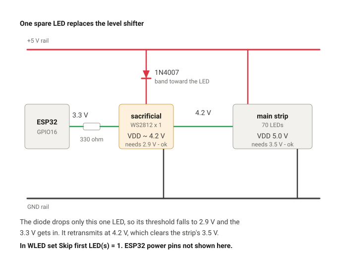
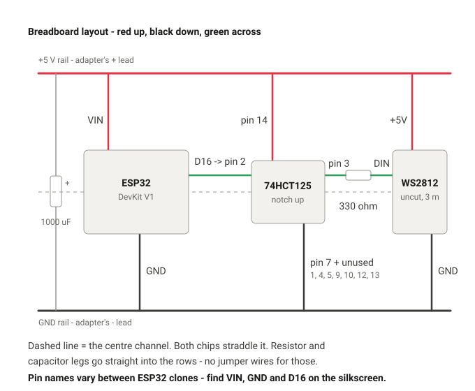

# Building the desk node

Order matters here. The strip gets cut and stuck down in stage 3, which is
irreversible; stages 1 and 2 prove the whole electrical and network chain first,
on the uncut strip, where a mistake costs nothing.

---

## Stage 1 - bench bring-up

### 1.1 Flash WLED - DONE 25 Sep 2026

WLED **16.0.1** is on the board, installed from install.wled.me in Chrome over
USB (Basic mode, Plain variant, 5 V adapter unplugged).

> **Do not flash it again.** Everything that remains happens over Wi-Fi.

Two notes worth keeping:

- The board enumerates as `Silicon Labs CP210x USB to UART Bridge`; on this
  machine it appeared on COM12. Always read the chip name, never the COM
  number - see "Telling the two ESP32s apart" in HARDWARE.md.
- The cable is a repurposed Amazon Fire TV Stick micro-USB lead that turned out
  to carry data. No cable was bought.

### 1.2 Node address - DONE

There is **no DHCP reservation and none is needed.** The Airtel AirFiber
outdoor CPE's admin page is not reachable, so the node is addressed by mDNS:

```
wled-desk.local   ->   192.168.1.6
2.4 GHz, channel 4, 100% signal
```

Hyperion discovers WLED by mDNS, so a moving lease does not matter. Use
`wled-desk.local` everywhere and treat the IP as a debugging aid only.

### 1.3 First contact - DONE

`tools/wled_push.py` has been verified against this exact node, and `name` has
already renamed it. `probe` is read-only and safe to re-run at any time:

```bash
python tools/wled_push.py probe --host wled-desk.local
```

The node currently reports the WLED default of **30 LEDs**. That is expected -
nothing is wired yet, and the real 70 is pushed in Stage 3.

---

### 1.4 Wire the breadboard - NEXT

**Nothing electrical in this build has ever been powered up.** Do this before
cutting the strip. If the first time the circuit is energised is also the first
time your first-ever solder joints are energised, a dark strip has two possible
causes and no way to tell them apart.

Build it with the **full 3 m strip uncut** and the **adapter unplugged**
throughout. Plug in only at 1.5.

#### Gather first

| | Part |
|---|---|
| 1 | ESP32 DevKit V1 (already flashed) |
| 1 | 74HCT125, DIP-14 |
| 1 | 1000 uF 25 V electrolytic |
| 1 | 0.1 uF ceramic |
| 1 | 330 ohm resistor |
| 1 | 5 V 5 A adapter + DC barrel pigtail (female, with leads) |
| 3 | lengths of 22 AWG silicone wire - red, black, green |
| - | breadboard, jumper wires, multimeter |
| - | the 3 m WS2812 strip, uncut |

> ## HOLD - 26 Sep 2026: do not build the sacrificial pixel from this section
>
> A third independent review overturned it. The sacrificial pixel has LESS
> worst-case margin than the diode-clamp alternative, not more, and the
> two-diode version is too sensitive to which brand of 1N4007 you happen to
> own (vendor curves disagree by 80 mV at the relevant current, and it is a
> two-diode stack). Neither diode circuit closes on datasheet worst case.
>
> The correct answer is a **74AHCT125 or 74HCT245** buffer, which does close on
> worst case and whose margin grows rather than shrinks as the rail rises.
>
> The go/no-go is the measured adapter voltage. This section is being rewritten;
> do not wire from it yet.

> ### No 74HCT125 - use a sacrificial pixel instead
>
> The SP Road shops do not have one (five or six asked) and mail order would
> cost days. **You do not need one.** A single WS2812 cut from the offcut does
> the same job, and it is a recognised technique rather than a bodge - WLED
> even has a setting for it.
>
> **How it works.** A WS2812 needs a logic high of 0.7 x its own VDD. Power one
> LED through a 1N4007 so it sits at about 4.2 V instead of 5 V, and its
> threshold drops to roughly 2.9 V - which the ESP32's 3.3 V clears easily.
> That LED then retransmits the data from its own push-pull output at about
> 4.2 V, and 4.2 V comfortably exceeds the 3.5 V the 5 V main strip needs.
> One cheap LED bridges the gap from both directions at once.
>
> Only that single LED draws current through the diode - 60 mA at worst against
> the 1N4007's 1 A rating - so there is no thermal problem, and the main strip
> still runs at a full 5 V with no brightness or colour penalty.
>
> Add `0.1 uF` across the sacrificial LED's own +5V and GND while you are there.

#### Wiring the sacrificial pixel



Cut **one LED** off the 183 cm offcut - a single ~1.67 cm segment with half a
pad at each end.

| From | To | Note |
|---|---|---|
| + rail | 1N4007 anode (plain end) | |
| 1N4007 cathode (**banded** end) | sacrificial LED **+5V** | band points at the LED |
| sacrificial LED **GND** | - rail | |
| ESP32 **GPIO16** | 330 ohm -> sacrificial LED **DIN** | |
| sacrificial LED **DOUT** | main strip **DIN** | no resistor needed |
| main strip **+5V** | + rail | full 5 V, not through the diode |
| main strip **GND** | - rail | |

Mind the arrows on both pieces - data still only flows one way.

In WLED, set **Skip first LED(s) = 1** in LED Preferences. The sacrificial pixel
then stays dark and your 70 real LEDs address as 0-69, so nothing downstream
changes and the committed Hyperion layout still fits.

> **Do not tick "Reversed" at the same time as "Skip first LED".** WLED ignores
> the skip when reverse is on ([issue #3346](https://github.com/wled/WLED/issues/3346)),
> and your sacrificial pixel starts animating. If `walk` later shows the strip
> running the wrong way round, fix it by regenerating the Hyperion layout, not
> with the reverse checkbox.

Physically, tuck the sacrificial LED inside the node box or tape it face-down
behind the monitor. It is dark in normal use, but it is one more thing not to
leave dangling.

#### First, how a breadboard is joined up inside


Everything else on this page depends on that picture. The rails run the length
of the board; the columns are groups of five; and nothing conducts across the
centre channel.

#### Seat the two chips

The ESP32 and the 74HCT125 both **straddle the centre channel** of the
breadboard, so each leg lands in its own row. If a chip sits on one side only,
every pin on that side is shorted to its neighbours through the row.

The 74HCT125 has a **notch at one end and a dot next to pin 1**. Pin 1 is at the
notch end. Numbers run **down one side and back up the other**: 1-7 down the
left, then 8-14 up the right, so pin 14 sits opposite pin 1.

#### The finished layout



Red wires go up to the + rail, black wires down to the GND rail, green carries
the data left to right. The table below is the same thing as a checklist -
work down it and tick each row off.

#### Then wire, in this order

| # | From | To | Wire |
|---|---|---|---|
| 1 | pigtail **+** (usually red, or the striped lead) | breadboard **+ rail** | - |
| 2 | pigtail **-** | breadboard **- rail** | - |
| 3 | 1000 uF **long leg (+)** | + rail | - |
| 4 | 1000 uF **short leg, stripe side (-)** | - rail | - |
| 5 | ESP32 **VIN** | + rail | red |
| 6 | ESP32 **GND** | - rail | black |
| 7 | 74HCT125 **pin 14** | + rail | red |
| 8 | 74HCT125 **pin 7** | - rail | black |
| 9 | 0.1 uF, either way round | between **pin 14 and pin 7**, close to the chip | - |
| 10 | 74HCT125 **pins 1, 4, 5, 9, 10, 12, 13** | - rail | black |
| 11 | ESP32 **GPIO16** (silkscreen may say D16) | 74HCT125 **pin 2** | green |
| 12 | 74HCT125 **pin 3** | one end of the **330 ohm** | - |
| 13 | other end of the 330 ohm | strip **DIN** | green |
| 14 | strip **+5V** | + rail | red |
| 15 | strip **GND** | - rail | black |

> **There is no 74HCT125 right now**, so skip rows 7-12 of this table
> entirely and wire the sacrificial pixel described above instead. Rows 1-6,
> 14 and 15 are unchanged. A real buffer slots in later without disturbing
> anything else.

Leave 74HCT125 pins **6, 8 and 11** empty - they are the unused buffer outputs.

**Every other pin goes to ground.** Floating CMOS inputs sit at mid-rail and
draw through-current; grounding the unused enables simply switches those
buffers on with their inputs low, which drives nothing and is harmless.

**Which end of the strip is DIN?** The arrows printed on the strip point
*away* from DIN, in the direction data travels. Connect to the end the arrows
point away from. Getting this backwards lights nothing at all.

#### Measure the adapter before anything else


Use the **5 V 5 A** adapter, not the 3 A one - the 3 A is for the shelf node
later. They look alike, so read the fine print on the brick and put a strip of
tape on each marked "5A desk" and "3A shelf".

Every logic threshold in this build is 0.7 x whatever this adapter actually
puts out, so the nominal 5 V is not good enough. Cheap 5 A bricks commonly sit
at 5.1-5.3 V, and the level-shifting margins shrink as that number rises.

1. Adapter unplugged from the wall. Nothing else connected.
2. Push the **DC pigtail** onto the adapter's plug - that is the barrel socket
   with two bare wires, and it is far easier to probe than the plug itself.
3. Multimeter: **black lead into COM**, **red lead into the socket marked V or
   VOhmmA**. NOT the socket marked 10A or 20A - that one is for measuring
   current, and touching it across a supply is a dead short.
4. Dial to **V with the straight line** (DC volts). If the dial has numbers,
   choose 20. Not V with the wavy line - that is AC.
5. Plug the adapter into the wall and switch on.
6. Black probe on the pigtail's black wire, red probe on the red wire. Do not
   let the two bare wires touch each other.
7. Read the number and write it down. Then switch off at the wall.

A minus sign just means the probes are the other way round - harmless, swap
them. Anything from 4.9 to 5.3 is normal. Above 5.3, stop and say so.

#### Check before you plug anything in

1. **Capacitor polarity.** The stripe is the negative side, and the short leg.
   Backwards is the one mistake on this board that makes a mess.
2. **Chip orientation.** Notch and dot at the pin-1 end. Confirm pin 14 is the
   one on the + rail, not pin 1.
3. **Short test.** Multimeter on resistance across the + and - rails. It will
   start low and **climb** as the 1000 uF charges from the meter - that is
   normal and is not a fault. A real short sits near 0 ohm and stays there.
4. Walk the table above once more, row by row.

### 1.5 Light it up - NEXT

Plug the adapter in. USB stays out from here on.

The ESP32 boots, WLED rejoins Wi-Fi, and `wled-desk.local` comes back. Then, in
the WLED web interface, **before touching brightness**:

- Config -> LED Preferences
- LED count **180**, GPIO **16**, type WS281x, colour order **GRB**
- Auto-brightness limiter **on**, **1000 mA**, 55 mA/LED

Then set brightness to roughly 25% and pick a solid colour.

> 180 LEDs at full white is 9.9 A. Breadboard rails and jumper wires are good
> for about 1 A, which is why the limiter goes to **1000 mA** for this test and
> not the 3000 mA the finished build uses. The final build feeds the strip
> straight from the rail, never through a breadboard.

**Success looks like:** every LED lights, the colour you chose is the colour
you get, and nothing warms up except mildly the strip.

| Symptom | Cause |
|---|---|
| Nothing lights at all | DIN and DOUT swapped - check the arrows |
| Only the first LED lights | Data is not getting past it. Check the 330 ohm is in series and not to ground, and that pin 1 is actually at GND |
| Red and green swapped | Colour order is RGB, not GRB |
| ESP32 resets as it brightens | Adapter sagging, or the 1000 uF is not truly across the rail |
| Random flicker | A loose breadboard leg, or the 74HCT125 is not straddling the channel |

Stage 1 is done. **Do not cut anything yet.**

---

## Stage 2 - measure and plan - DONE

Measured directly off the back of the monitor: the strip path is
**57 x 30.5 cm**. Generated with:

```bash
python tools/led_layout.py --width 57 --height 30.5 --write
```

| Run | LEDs | Cut to |
|---|---|---|
| left | 18 | **30.0 cm** |
| top | 34 | **56.7 cm** |
| right | 18 | **30.0 cm** |
| **total** | **70** | 116.7 cm of 300 cm, **183 cm spare** |

`config/hyperion_leds.json` and `config/wled_desk_cfg.json` are committed and
populated. The count is insensitive to the exact width - anything from 56 to
57.5 cm gives the same 34/18/18 split.

The back of this monitor is **smoothly curved, with no flat rectangular
region**. That is workable; see "Mounting" in HARDWARE.md.

### Three sides, not four

Left, top and right, with no bottom run. On a monitor at desk height the bottom
strip lights the desk rather than the wall, it is where the stand column and
later the Dyazo arm sit, and it costs two extra corner joints. Hyperion handles
a missing bottom edge natively, and 183 cm of spare strip means adding it later
costs nothing but solder.

---

### Corners - cutting and soldering

WS2812 will not bend around a 90 degree corner; the copper cracks. Each corner
is a cut and three short wires. Two corners, six wires, twelve solder joints.

#### If this is your first soldering job, practise on the offcut

The run uses 117 cm of a 300 cm strip. **183 cm of spare strip exists purely so
the first joints you ever make are not the ones on the monitor.**

Cut three short practice pieces, join them, power them, and only move to the
real lengths when you can do three joints in a row that look right and pass
continuity. That hour is the cheapest insurance in this build - a lifted pad on
a real length means re-cutting and losing LEDs.

Three things decide whether soldering feels easy or impossible, and beginners
usually get all three wrong at once:

1. **A clean, tinned tip.** Wipe it on a damp sponge or brass wool and melt a
   little fresh solder onto it before every few joints. A dull, blackened tip
   transfers almost no heat, so the joint will not take, so you hold the iron
   there longer, so you cook the LED. Nearly every "my iron is too weak"
   problem is a dirty tip.
2. **Leaded 60/40 solder, not lead-free.** It melts lower and flows far more
   willingly. Lead-free is a miserable place to learn. Wash your hands after.
3. **Do not crank the temperature up.** About 330 C. Hotter does not mean
   faster, it means you burn flux off before it can do its job and you lift
   pads off the flexible PCB.

Work in a ventilated spot and do not lean over the smoke - that is flux, and it
is unpleasant to breathe.

**What a good joint looks like:** shiny, smooth, slightly concave where it
meets the pad, like a tiny ski slope. **Bad:** dull and grainy (moved while
cooling), or a ball sitting on top of the pad without wetting it (not enough
heat, or no flux). A ball that will not flatten is a cold joint - reflux it and
reheat briefly rather than piling on more solder.

#### Before any cut: check the arrows

Every piece of strip has arrows showing which way data flows. Data only travels
one way. Lay all three pieces out in the U shape on the bench first and confirm
**every arrow points the same way around the U**: up the left side, across the
top, down the right. A piece fitted backwards lights nothing downstream of it,
and you will not notice until the whole thing is stuck to the monitor.

Decide at the same time which end is the overall DIN, the corner where the
controller cable enters. Default here is the bottom of the left run viewed from
the front.

#### Cutting

Cut **down the middle of the copper pads**, on the line marked between LEDs, so
both halves keep half a pad each. Sharp scissors. If the strip is silicone
sleeved, trim 8-10 mm of silicone back off each end to expose the pads.

#### Soldering


The WS2812 chip sits a couple of millimetres from its pads, and heat is what
kills it, not solder. Short bursts, never a long dwell.

1. Flux the pads.
2. **Tin each pad**: touch iron and a little solder, 1-2 seconds, off. A small
   dome, not a blob.
3. **Tin the wires**: cut to about 3 cm, strip 3-4 mm, twist the strands, tin.
4. **Join**: hold the tinned wire against the tinned pad, touch the iron for
   1-2 seconds until the two pools flow together, remove the iron, then **hold
   the wire still until it sets** - a joint moved while cooling goes dull and
   brittle.
5. If it will not take, add flux and try again briefly. Do not hold the iron on
   longer.

Tinning both sides first is the whole trick. A beginner trying to hold iron,
solder, wire and strip all at once on a 2 mm pad will fail; tinning turns it
into one easy step.

Clamp the two pieces at the actual 90 degrees in the helping hands while you
solder, so the wires end up the right length. Solder them straight, then bend
them, and the wires fight you forever.

Use the full 3 cm of wire even though the gap is smaller. Slack is easy to
tuck away; a too-short wire under tension will eventually pull a pad off.

| Upstream piece | Wire | Downstream piece |
|---|---|---|
| +5V | red | +5V |
| DO / DOUT | green | DI / DIN |
| GND | black | GND |

**Match pad names, not positions.** At a corner one strip is rotated 90 degrees
relative to the other, so the pads do not line up left-to-right the way they
appear to. Read the silkscreen every time.

#### Test after every connection, not at the end

The same rule written into the JiffyTrails build plan (a separate repo), and it matters
more here because a fault found after twelve joints could be any of them.

- Continuity across each join with the multimeter as you make it.
- Check for bridges **between adjacent pads** - especially +5V to DATA, and
  +5V to GND. A +5V-to-GND bridge is a dead short across the supply.
- Heat-shrink or a dab of hot glue over each finished joint. The joint is the
  weakest mechanical point on the run and it is about to live on a curved
  surface.

#### Then test it flat

Assembled U flat on the bench, still on the breadboard, before any backing
paper comes off. This is the last easily reversible moment in the build.

---

## Stage 3 - cut, solder, mount - NOW

1. Cut the runs: **56.7 cm** (top, 34 LEDs) and **30.0 cm** x2 (sides, 18 LEDs
   each). Practise joints on the 183 cm offcut first.
2. Solder the corner jumpers. Test the assembled run flat on the bench, still
   on the breadboard, before any adhesive touches the monitor.
3. IPA the back panel, let it dry.
4. Stick it down, starting at the DIN corner. Velcro tie or a dab at each
   corner turn — that is where adhesive fails first.
5. Run the injection pair from the far end of the strip back to the rail.
6. Raise the ABL from the bench-test 1000 mA to **3000 mA** and set the real
   count of 70:

```bash
python tools/wled_push.py apply --host wled-desk.local
```

7. Confirm the orientation with your eyes before Hyperion is configured
   against an assumption:

```bash
python tools/wled_push.py walk --host wled-desk.local
```

Note which corner LED 0 sits in **viewed from the front of the screen**, and
which way the white pixel travels. Remember you are looking at the back while
you mount, so left and right are mirrored under your hands. If it runs the
wrong way, set `rev: true` on the bus rather than re-soldering anything.

8. Save the presets:

```bash
python tools/wled_push.py presets --host wled-desk.local
```

---

## Stage 4 - final assembly - LATER

Move off the breadboard onto the 6 x 4 inch dot board: ESP32 on female headers
(so it can come off), 74HCT125 on a socket, the 1000 uF and the 330 ohm on
board, screw terminals or JST for the strip and the DC pigtail.

The board lives in the MICKE desk's under-desk strip, velcroed down, with the
5 V adapter on the switched power strip.

Leave room on the dot board for the IRL540N and its gate network — L3 lands on
the same board when the 12 V adapter arrives, and rebuilding it then would be
annoying.

---

## Stage 5 - Hyperion - LATER

[HYPERION.md](HYPERION.md).
