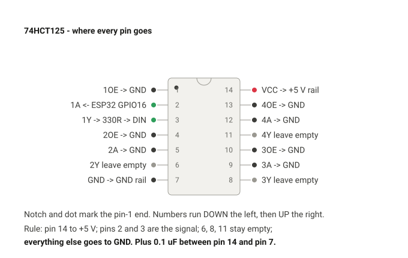

# Hardware — desk node

Everything on this page is physically in hand unless marked otherwise.
Bought at SP Road (Om Technology Centre, F4 SRNG Complex) on 25 Sep 2026.

---

## Parts used by the screen sync light

| Part | Qty used | Note |
|---|---|---|
| ESP32 NodeMCU DevKit V1, 30-pin, CP2102 | 1 | the desk node |
| WS2812 strip, 5 V, 60/m, black PCB | ~1.2 m of the 2 m | **two separate strips: 1 m (60 LEDs) and 2 m (120 LEDs)**, not one 3 m. "2812" without the B; GRB confirmed on the bench |
| 1000 uF 25 V electrolytic | 1 | bulk across the 5 V rail |
| 0.1 uF ceramic | 1 | decoupling across the 5 V rails, near the node |
| 1N4007 diode | 1 | the diode clamp - banded end to RX2 |
| 470 ohm, 1/4 W (330 acceptable) | 1 | clamp pull-up, junction to +5 V |
| 5 V 3 A adapter, 5.5 x 2.1 | 1 | **use this one.** The 5 A brick has an IEC C8 inlet and no mains lead |
| DC barrel pigtail, female with leads | 1 | |
| Silicone wire 22 AWG red/black/green | ~2 m | used up on 26 Sep except ~25 cm red/black and ~1 m green; LED 1's +5V/GND leads are JiffyTrails silicone in other colours |
| Heat-shrink assortment | 1 pack | strip ends; slide on before the second end is soldered |
| Dot board, isolated pad, 6 x 4 inch | 1 of 3 | the node - PERFBOARD.md |
| Female header 40-way | 1 | cut into two 15-pin lengths for the ESP32 |
| Velcro cable ties | 2–3 | |

**Not needed for screen sync**, despite being in the same node design:
IRL540N + the 12 V Gesto strip (that is L3, waiting on a 12 V 1 A adapter),
INMP441 (music mode), LDR (auto-dim), LD2420 (presence, deferred).

---

## Telling the two ESP32s apart

Two ESP32 boards live on this desk and they must never be confused at flash
time - one runs the room lighting, the other is the JiffyTrails navigator.
They use different USB-serial chips, so Device Manager settles it:

| Board | Project | USB chip | Enumerates as | Connector |
|---|---|---|---|---|
| NodeMCU DevKit V1, 30-pin | **this repo**, desk node | CP2102 | `Silicon Labs CP210x USB to UART Bridge`, `VID_10C4&PID_EA60` | micro-USB |
| WEMOS LOLIN32 | JiffyTrails navigator | CH340 | a CH34x device | USB-C |

Confirmed 25 Sep 2026: the desk node came up on **COM12** as
`Silicon Labs CP210x USB to UART Bridge`, Status OK.

Read the chip name, not the COM number - Windows reassigns COM numbers freely.
If you see CH340, you are about to flash the motorcycle display. Stop.

### Cable - resolved, nothing bought

Micro-USB (Micro-B) to USB-A, carrying **data**, not just power. A spare Amazon
Fire TV Stick lead turned out to be a full data cable and enumerated first time.

Kept for the next board (the Wemos D1 mini is micro-USB too). To re-verify
without opening the port:

```powershell
Get-PnpDevice -PresentOnly | Where-Object { $_.Class -eq 'Ports' } |
  Select-Object Status, FriendlyName
```

Enumerating devices is safe. **Opening the port from a script is not** - see
DECISIONS.md on scripted serial.

---

## Pinout

The full desk-node pin map, including the parts that arrive later. Only GPIO16
matters for screen sync.

| Pin | Goes to | Via | Stage |
|---|---|---|---|
| GPIO16 (`RX2`) | WS2812 DIN | **diode clamp**: 1N4007 banded end at GPIO16, junction pulled up by 470 ohm to +5 V, junction -> DIN | **L2, proven** |
| GPIO25 | IRL540N gate | **direct**, 100 ohm series; 10k gate->GND. Logic-level FET, no buffer needed | L3 |
| GPIO32 / 14 / 15 | INMP441 SD / SCK / WS | direct; VDD 3V3, L/R -> GND | music |
| GPIO34 | LDR divider | 3V3 -> LDR -> node -> 10k -> GND | auto-dim |
| GPIO27 | LD2420 presence OUT | direct; sensor on 3V3 | deferred |
| GPIO33, GPIO17 | spare | | |

**Keep free:** GPIO0, 2, 12 (strapping), GPIO1/3 (UART0), GPIO6–11 (flash).

### Finding the pins on this actual board

The DevKit V1 silkscreen does **not** say "D16". Confirmed from a photo of the
board in hand (module marked ESP-32, USB bridge marked SILABS CP2102):

| Needed | Silkscreen label | Where it physically is |
|---|---|---|
| **GPIO16** | **`RX2`** | right column, **6th pin up from the bottom-right corner**: 3V3, GND, D15, D2, D4, **RX2** |
| VIN | `VIN` | **bottom-left corner pin** |
| GND | `GND` | immediately above VIN. A second GND sits above 3V3 on the right |
| 3V3 | `3V3` | bottom-right corner pin |

GPIO16 is UART2's receive pin, hence `RX2`. Nothing in this project uses UART2,
so the label is only a label.

Full silkscreen, bottom to top:

```
 left  : VIN GND D13 D12 D14 D27 D26 D25 D33 D32 D35 D34 VN VP EN
 right : 3V3 GND D15 D2  D4  RX2 TX2 D5  D18 D19 D21 RX0 TX0 D22 D23
```

**GPIO16 and GPIO17 being broken out at all confirms a WROOM-class module, not
a WROVER** - on WROVER those two pins are the PSRAM interface and are not
available. The pin choice stands.

### 74HCT125 (DIP-14) - historical, NOT fitted

> Kept for reference only. The shop supplied a CD74HCT112EX in its place, which
> bench-tested as an HC part (switches at 0.7 x VCC, not 2 V) and could not
> shift 3.3 V. The **diode clamp replaced it and is proven** - see BUILD_DESK_NODE.md
> 1.5 and 1.6. No buffer IC is used anywhere in this project: the desk strip uses the
> clamp, and the two IRL540N MOSFETs are logic-level and are driven straight from a
> GPIO through 100 ohm.




```
   1  1OE  -> GND            14  VCC -> +5V rail
   2  1A   <- ESP32 GPIO16   13  4OE -> GND
   3  1Y   -> 330R -> DIN    12  4A  -> GND
   4  2OE  -> GND            11  4Y   (leave empty)
   5  2A   -> GND            10  3OE -> GND
   6  2Y   (leave empty)      9  3A  -> GND
   7  GND  -> GND rail        8  3Y   (leave empty)
```

Simple rule: **pin 14 to +5 V, pins 2 and 3 carry the signal, pins 6, 8 and 11
stay empty, everything else goes to GND.**

Every unused *input* must be tied, not left floating - a floating CMOS input
sits at mid-rail and draws through-current. Grounding the unused enable pins
(4, 10, 13) simply switches those buffers on with their inputs low, which
drives nothing and is harmless. 0.1 uF between pin 14 and pin 7, as close to the
chip as the board allows.

The T in 74HC**T**125 is the whole point: it has TTL-level input thresholds, so
a 3.3 V logic high from the ESP32 is read as a solid high while the output
swings to a clean 5 V. A plain 74HC125 has CMOS thresholds and 3.3 V sits
marginally close to them. Neither of the two chips bought turned out to be an
HCT125, and neither node needs one.

---

## Power budget, 5 V rail

**The 5 A adapter is unusable** — it arrived with an IEC C8 figure-8 inlet and
no mains lead. The build runs on the **5 V 3 A** adapter until that lead turns
up, and the power budget below is sized for 3 A.

| Load | Current |
|---|---|
| ESP32 with Wi-Fi active | ~0.25 A, peaks higher on TX |
| WS2812 strip, ABL capped at 2000 mA | 1.88 A (WLED reserves 120 mA for the ESP) |
| **Worst case including a Wi-Fi TX peak** | **~2.4 A of 3 A — 79%** |

### Why the ABL cap is 2000 mA

Earlier revisions of this file argued for 3000 mA on a 5 A supply. That number
is now wrong twice over: the 5 A supply cannot be used, and 3000 mA on a 3 A
brick means the LED budget alone equals the adapter's entire nameplate rating
before the ESP32 transmits.

| ABL | Strip gets | Fraction of full white | Worst case total | % of 3 A |
|---|---|---|---|---|
| 3000 | 2.88 A | 73% | ~3.4 A | **113% — no** |
| 2500 | 2.38 A | 61% | ~2.9 A | 97% — too close |
| **2000** | **1.88 A** | **49%** | **~2.4 A** | **79%** |
| 1500 | 1.38 A | 35% | ~1.9 A | 63% — conservative |

**49% of full white is much brighter than "half".** Perceived brightness goes
roughly as the cube root of luminous flux, and a bias light essentially never
shows full white across all 70 LEDs — real video sits nearer 0.5–1.0 A. The
limiter will rarely clamp visibly. 2000 is sensible, not stingy; 3000 is not
headroom, it is the cliff edge.

Two things about WLED's limiter that are easy to get wrong:

- **It is an estimate, not a measurement.** WLED's own source says so. It sums
  brightness-scaled colour channels against your mA-per-LED figure. Keep your
  own margin.
- **The number is a whole-system budget.** WLED subtracts a fixed 120 mA for
  the ESP32 before allocating the rest to LEDs, so do not add the ESP32's
  draw on top of the figure you type.
- **Never set the cap, or the mA-per-LED, to 0.** Either one *disables* the
  limiter entirely.

If the node browns out or resets on bright scenes, drop to 1500 and retest
before blaming wiring.

### Injection

Feed +5 V and GND to **both ends** of the strip run, **straight from the
supply** — not through the ESP32, and never through breadboard rails at any
stage. Breadboard contacts are good for roughly 1 A and they fail by
slackening permanently, not by tripping.
At ~70 LEDs a single feed would work, but the far end would run visibly warmer
in colour, and the second feed costs two wires.

---

## The strip

**Two strips**, not one: a 1 m (60 LEDs) and a 2 m (120 LEDs), 5 V, 60/m,
black PCB, bought as "2812" without the B. Discovered on the bench when only
60 of a configured 180 lit - there was never a fault. Same one-wire protocol,
**GRB colour order confirmed** (commanded red shows red), same 800 kHz timing;
WLED bus type `WS281x`. The three build pieces come from the 2 m strip; the
1 m stays whole as practice material and a bench tester with its factory
connectors intact.

- Cuttable every LED at the printed copper pads (60/m strips are).
- Each cut piece needs its own +5 V, GND and DATA connection.
- Check whether yours is bare (IP30) or silicone-sleeved (IP65) before
  planning corners: sleeved strip needs the silicone trimmed back at every
  cut, which roughly doubles the fiddliness of each joint.

---

## Mounting

**This monitor's back is smoothly curved - there is no flat rectangular area.**
That is workable. The strip is flexible along its length and will follow a
gentle curve happily; what defeats strip adhesive is curvature *across* the
10 mm width, which makes the edges lift. There is even an upside: on a curved
back the side runs angle their light slightly outward instead of straight back,
which spreads it better on the wall.

So do not hunt for a flat region. Pick the line that clears the rear joystick
with finger room, follow the curve, and:

- **Never stretch the strip round the curve.** Tension stored in the strip is a
  slow-motion peel. Let it lie where it wants.
- **Reinforce both corners mechanically** - a velcro tie, an adhesive cable
  clip, or a dab of hot glue. Peel always starts at a corner and then unzips.
- **Press hard along the whole length.** 3M adhesive needs pressure to wet out
  and does not reach full strength for a day or two, so do not judge it on day
  one.
- If one run sits on a noticeably steeper part of the curve, nudge it inboard
  to where it flattens. The LED count has 3 mm of slack either way.

Clean the monitor's back panel with IPA and let it flash off before the 3M
backing goes anywhere near it. Textured ABS plus Bengaluru ambient plus the
warmth off the panel is exactly the combination that has strip adhesive
peeling at the corners three months later. The corners are where it lets go
first, so put a velcro tie or a dab of something at each corner turn.

The VESA pattern is 100 x 100 mm in the centre of the panel. A perimeter strip
path 2–3 cm in from the edge clears it, so fitting the Dyazo arm later does not
disturb the strip.
