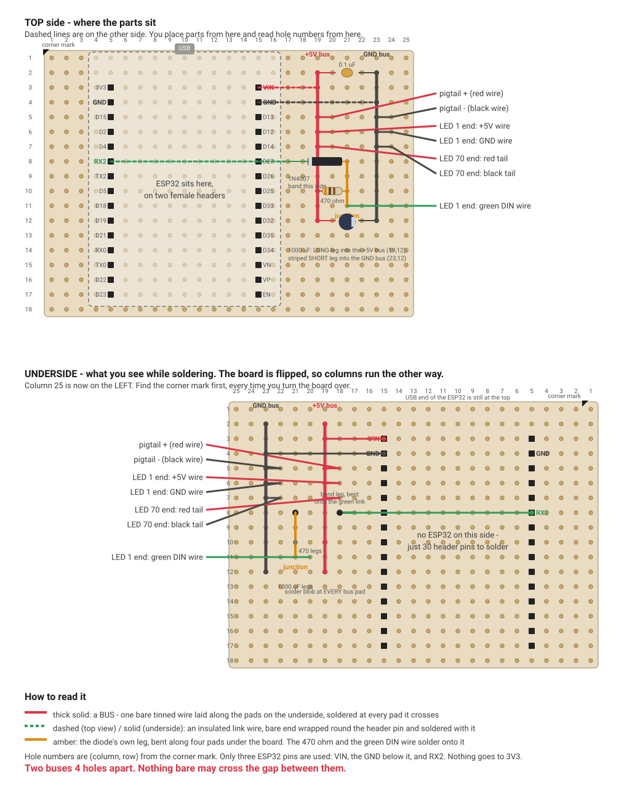

# Desk node on the dot board

The bench circuit, moved off the breadboard onto one of the 6 x 4 inch
isolated-pad dot boards. Same circuit, same seven parts, nothing new to buy.
The breadboard carried the strip's 600 mA on the bench and that is about its
limit - the clips loosen and the rail sagged 0.3 V. Soldered bus wires carry
2 A without complaint, and they do not fall out when the monitor moves. This
is the owner's first dot board, so it is written for that. It has been through
two independent reviews (26/27 Sep 2026); the layout below is the reworked one.



Hole positions are **(column, row)**, counted from the **corner mark**: a
marker dot you put on the **top-left corner** of the board - top-left as you
look at the top side with the USB edge away from you - on both faces, before
anything else. Column 1 is the corner-mark column, row 1 the corner-mark row.
The ESP32's USB socket faces the top edge. Any other corner and the ESP32's
pin sides swap. The drawing shows 27 x 18 holes; the
ESP32's antenna end reaches about 5 rows below that, and the full board is
bigger still. No cutting needed.

## Four things a dot board does differently from a breadboard

1. **Nothing is connected until you connect it.** Every hole is its own copper
   ring. On the breadboard, five holes in a row were joined for you. Here you
   join them yourself, two ways, and this layout uses both:
   - **A bus:** a bare wire laid along a row of holes on the underside,
     soldered to the pads. Anything pushed through one of those holes gets
     soldered into the same blob and is on the bus. Two here: +5V and GND.
   - **A bent leg:** push a part or wire through, and on the underside bend
     the bare end across to the next pad, then solder. Every link wire
     reaches its ESP32 pin this way, and the diode's plain leg is bent along
     four pads to make the junction.
2. **It is mirrored when you flip it.** Turn the board over **left-to-right,
   like a page**, so the USB end stays at the top - then column 1 is on the
   right and the rows are unchanged. Turn it end-over-end and everything is
   wrong. Find the corner mark every time you turn it. The drawing shows both
   faces.
3. **A bare wire or leg laid along pads must not cover the holes.** Lay it
   beside the hole centres, along the edge of the pad rings, so a leg can still
   come through later. Which side: the +5V bus wire on the column-18 side of
   column 19, the GND bus wire on the column-24 side of column 23, the
   junction leg on the column-20 side of column 21 - so every bare run is two
   full pitches from the nearest other net. If a leg does meet wire across its hole: heat that
   joint, push the leg through while the solder is molten, add a touch of
   solder.
4. **Solder is permanent, but not that permanent.** A part in the wrong hole
   comes out: heat the joint, pull the leg with pliers while it is molten. A
   pad lifts only if the iron stays on for many seconds. Two or three seconds
   per joint, always.

## The joint itself

Iron at 330-350 C for 60/40 solder. Tin the tip first. **Rosin flux only** -
the paste sold for plumbing is acid and corrodes boards.

1. Leg or wire through the hole from the top. Bend it slightly on the
   underside so it cannot fall out.
2. Iron tip touching **both the pad and the leg** at once, for 1 second.
3. Feed solder into the joint, not onto the iron, until it flows round the
   leg and makes a small cone the size of a grain of rice.
4. Iron off. Do not move the leg for 2 seconds.

Good: a shiny cone wetting both pad and leg. Bad: a ball on the leg not
touching the pad (pad not heated), or a dull grainy blob (moved while
cooling). Pads are 2.54 mm apart; if solder joins two neighbours that should
not be joined, drag a clean hot tip through the gap, or add flux and touch
again - the solder pulls back onto the pads. Clean the tip on the sponge every
few joints; a black tip transfers no heat, and the answer is never "hold it
longer".

**Trimming, two rules.** A leg that goes **straight through** its pad is cut
1-2 mm above its cone once soldered - that includes both resistor legs at
(19,10) and (21,10), both 0.1 uF legs, the long cap leg, the diode's band leg. A
leg that is **laid along pads** (the junction leg, the cap's short leg, the
four link ends) is cut only **after** it has been bent and soldered, **1 mm
past the last pad it is meant to reach** - a 1N4007 lead is 25 mm long and
the uncut remainder reaches the next net. Safety glasses when clipping, then
brush the board clean: a clipping across two pads is the classic phantom
short.

## The parts and where they go

| Part | Holes | Note |
|---|---|---|
| Female header, 15 pins | column 5, rows 3-17 | left row of the ESP32 |
| Female header, 15 pins | column 15, rows 3-17 | right row |
| +5V bus, bare wire | column 19, rows 2-16 | underside |
| GND bus, bare wire | column 23, rows 2-16 | underside |
| Link, red, insulated, ~2 cm | (16,3) to (19,3) | **top side**. Underside: the (16,3) end is bent across onto the VIN pin's cone at (15,3) and soldered to it |
| Link, black, insulated, ~4 cm | (16,4) to (23,4) | top side. Underside: (16,4) end bent onto the GND pin at (15,4) |
| Link, green, insulated, ~10 cm | (4,8) to (16,8) | top side, **round the top end of the ESP32**: up column 4 to row 1, across along row 1 above the headers (under the USB socket's overhang, which is 8 mm up), down between columns 17 and 18, then across into (16,8). It cannot cross the header bodies. It crosses over the red and black links on the way down; all three are insulated, that is fine. Underside: (4,8) end bent onto the RX2 pin at (5,8); (16,8) end bent onto the diode's band leg at (17,8), **toward 17, away from the D27 pin at (15,8)** |
| 1N4007 | band end (17,8), plain end (21,8) | **band toward the ESP32**. Underside: plain leg laid down column 21 beside the holes of rows 9, 10, 11 = the **junction**; soldered at rows 8 and 9 at step 4 and **cut 1 mm past (21,11) right then**; rows 10 and 11 are soldered when the resistor and DIN wire arrive |
| 470 ohm | (19,10) and (21,10) | **standing upright**: body on end over (19,10), that leg straight down. The other leg comes off the top of the body in a **straight slant to (21,10)**, like a tent guy-rope - not folded down the side of the body, where it would sit 1 mm from the bare +5V lead. **Slide a 10 mm piece of insulation stripped off the 22 AWG wire over that leg first.** Goes in beside the junction leg and is soldered to it |
| 1000 uF | LONG leg (19,16), striped SHORT leg (21,16) | its natural 5 mm spacing, no bending. Underside: short leg laid across (22,16) to the GND bus at (23,16), soldered at (21,16) and (23,16), **cut 1 mm past (23,16)**. The can sits over rows 14-18 (13-19 for a 13 mm can), clear of everything. **Fitted last, at step 8c**, so the flipped board does not stand on it |
| 0.1 uF | (19,2) and (23,2) | no polarity; legs bend to 4 holes easily |
| Pigtail red | (19,5) | |
| Pigtail black | (23,5) | |
| LED 1 +5V wire | (19,6) | |
| LED 1 GND wire | (23,6) | |
| LED 1 green DIN wire | (21,11) | in beside the junction leg, soldered to it |
| LED 70 red tail | (19,7) | |
| LED 70 black tail | (23,7) | |
| Strain-relief lash | (26,4) and (26,12) | a twist of bare wire over the wire bundle |

Only three ESP32 pins are used: **VIN (15,3), the GND below it (15,4), RX2
(5,8)**. Nothing goes to 3V3 or the other GND. The pin names are for the
30-pin DOIT DevKit V1 with the USB at the top: read them off the board's own
silkscreen before soldering anything to a pin - some clones shuffle labels.

Column 16 (and column 4) is just outside the ESP32's edge; the link wires'
insulation clears the header plastic by well under a millimetre, which is
fine, but push them through straight.

The ESP32's two pin rows are drawn 10 holes apart. **Let the board tell you
the real number**: push the headers onto the ESP32 first, then place the
assembly. That is also what guarantees the headers are the right distance
apart to ever seat again. If they land at columns 5 and 14, the right-hand
link holes become (15,3), (15,4) and the bends go onto (14,3), (14,4); the
diode and everything to its right stay put.

**Bus wire:** best is solid-core copper - one core out of an Ethernet cable,
or bell wire. The stranded silicone wire works if that is all there is: strip
5 cm, pull the strands straight, tin in short passes with flux until it is a
stiff rod. Not a paperclip (steel, solders badly). 5 cm per bus.

**Bus pads soldered at step 2** (the ones no leg ever enters): +5V bus rows
**4, 8, 9, 11, 12, 13, 14, 15**; GND bus rows **3, 8, 9, 10, 11, 12, 13, 14,
15**. Every other bus pad is soldered when its leg arrives, so the hole is
open until then. In the drawing's underside view those later joints are open
rings; step-2 joints are solid dots.

## Assembly order

Adapter unplugged from the wall throughout. Honest fallback: the ESP32 leaves
the breadboard at step 1 and comes back on the finished board at step 10;
from step 4 on the breadboard is being dismantled, and going back means
re-wiring it from BUILD_DESK_NODE.md 1.5. Its WLED config lives in the ESP32
and comes along untouched.

**0. Corner mark.** Marker dot on the top-left corner (top side, USB edge
away from you), both faces. No cutting needed.
If you ever do cut a board: brown paper-phenolic scores with a knife (5-6
passes each face along a row of holes) and snaps over a table edge; green or
yellow glass-fibre does not snap - hacksaw, and a mask for the dust.

**1. Headers - first, because they become the legs the flipped board stands
on.** Pull the 16th pin out of a female header strip with pliers, then cut
through the empty plastic; twice, for two 15-pin lengths. Push both onto the
ESP32's pins. Place the assembly on the board, USB at the top, headers into
columns 5 and 15 (or where they land), rows 3-17. Flip the board left-to-right;
put an eraser under the board's edge at the ESP32's antenna end and one
under each far corner, so the board lies flat instead of rocking on the USB
socket - the headers sit in one corner of a 6 x 4 inch board. Solder **one pin at each end of each
header** (4 joints). Flip back, check both headers sit flat and the ESP32 is
parallel to the board; if not, reheat that one joint and press. Solder the
other 26, two or three seconds each - the ESP32 is a fine heat sink, no risk
to it.

To remove the ESP32: prise a little at each end alternately, never rock it
sideways. Unplug it now and put it aside; it goes back on at step 10.

**1a. Meter, headers only.** Ohms 2000: (5,3) to (5,4) must read `1`, and
(15,3) to (15,4) must read `1`. 3V3-GND is the bridge no later check catches;
VIN-GND would show up again at step 7 as a bus-to-bus short, but you would
rather find it now. Then eyeball every gap in the two rows of 15 cones.

**2. Buses.** Underside. Lay one bus wire down column 19 from row 2 to row
16, beside the hole centres on the column-18 side. Solder it at rows 4 and
15 first so it stays put, then at rows 8, 9, 11, 12, 13, 14 (8 joints in
all). Same for column 23 on the column-24 side: rows 3, 8, 9, 10, 11, 12,
13, 14, 15 (9 joints). Trim the ends. Columns 20 and 22 stay empty apart
from the cap leg that crosses (22,16) at step 8c; column 21 is the junction.

**3. Links, on the top side.** Red through (16,3) and (19,3); black through
(16,4) and (23,4); green through (4,8) and (16,8), routed round the top end
of the ESP32 as in the table. Underside: bend each pin-side bare end (5 mm
stripped) across onto its header pin's cone - VIN, GND, RX2 - and reflow that
cone with the wire in it; then also solder the wire at its own hole, which is
the strain relief for the bend, and cut it 1 mm past the pin cone. Solder the
bus-side ends of red and black onto the buses. Leave the green (16,8) end
loose until step 4.

**4. Diode.** Band end (17,8), plain end (21,8), body flat on top. Underside:
bend the green link's bare end from (16,8) onto the band leg at (17,8) and
solder the two together. Solder the green wire at (16,8) too and cut it
1 mm past the (17,8) cone.
Lay the plain leg down column 21 **beside** the holes of rows 9, 10, 11, on
the column-20 side; solder it at **rows 8 and 9 only**; **cut it 1 mm past
(21,11) now**. Rows 10 and 11 stay open.

**5. 470 ohm, upright.** One leg into (19,10), body standing on it. Slide
the 10 mm sleeve of insulation over the other leg, then bring it down in a
**straight slant** into (21,10) beside the junction leg - not folded down the
side of the body. Solder (19,10) onto the bus; solder (21,10) with the
resistor leg and the diode leg in one joint.

**6. The 0.1 uF** into (19,2) and (23,2), soldered to the buses. The 1000 uF
waits until step 8c - a 20 mm tall can under a flipped board is what every later
underside job would rock on. Now trim every straight-through leg, brush the
board clean.

**7. Meter, before any outside wire goes on.** Adapter out, ESP32 out. On
this meter the **red lead is positive** on the ohms and diode ranges.
- Ohms 2000, red on the +5V bus, black on the GND bus: `1`. A small number is
  a short. Stop.
- Ohms 2000, +5V bus to the junction (column 21, rows 8-11): about **470**
  (447 to 494 is in tolerance).
- Ohms 2000, red on the junction, black on the GND bus: `1`.
- Ohms 2000, **red on the RX2 pin stub (5,8), black on the +5V bus**: `1`.
  Swap the probes: any number well above 470 (typically 700-1000) or `1` -
  that is the diode conducting through the 470. **A number in the first
  polarity = diode backwards. Near 470 either way = diode shorted.**
- **Diode range** (the diode symbol). Red probe on the junction, black on the
  RX2 pin stub: about 500-700. Swap: `1`. That proves the band is the right
  way **and** that the green link reaches the pin.

**8. The pigtail, checked before it goes on.** Adapter in, DCV 20, red probe
on the red lead, black on the black: **+5**, not -5. **Keep the two bare ends
apart - if they touch, the 3 A adapter shorts.** Adapter out. Trim both tinned
ends to 3 mm, red through (19,5), black through (23,5), solder to the buses.

**8a. Powered check of the clamp, nothing else connected.** ESP32 out, strip
wires not yet on, board the right way up - everything here is reachable from
the top. Strip 8 mm off both ends of a 5 cm scrap wire and push one end into
the **left header's 6th socket counting down from the USB edge** - that is
RX2. Leave the other end free. Adapter in. DCV 20, black probe on the 0.1 uF's
leg at (23,2) (it is on the GND bus), red probe on:
- the 0.1 uF's other leg at (19,2): about **5.0 V** - the +5V bus;
- the diode's bare plain lead between its body and (21,8): about **5.0 V** -
  the junction, pulled up through the 470;
- the same spot while you push the scrap wire's free end into the **right
  header's 2nd socket from the USB edge** (GND): the junction drops to about
  **0.7 V**. That is the diode doing its job; 9 mA through the 470, harmless.
  Stays at 5 V = diode backwards, or green link not reaching the pin.
**Adapter out, scrap wire out** - the RX2 socket sits at 5 V through the 470
while the adapter is in, and step 10 plugs the ESP32 into it.

**8b. The strip wires**, one at a time out of the breadboard, tinned end
trimmed to 3 mm, through from the top, soldered underneath: LED 1 +5V (19,6),
LED 1 GND (23,6), LED 1 green DIN (21,11) beside the junction leg, LED 70 red
tail (19,7), LED 70 black tail (23,7). Read the strip end, not the wire colour,
for the two LED 1 leads that are not red/black.

**8c. The 1000 uF.** LONG leg (19,16), striped SHORT leg (21,16); underside,
lay the short leg across (22,16) to the GND bus at (23,16), solder it at
(21,16) and (23,16), cut it 1 mm past (23,16); solder the long leg to the bus
and trim it.

**9. Strain relief.** Gather the seven wires into a bundle around column 26,
hold it with a piece of heat-shrink or tape, and lash it to the board with a
twist of bare wire through (26,4) and (26,12). Hot glue on top if there is a
gun - on its own hot glue barely holds silicone insulation.

**10. First power-up.** Plug the ESP32 in, USB at the top, all 30 pins
seated. It still carries the bench config (120 LEDs, ABL 600 mA), safe for a
first switch-on. Adapter in. Expect the four colour bands on the U, exactly
as on the breadboard. A meter check across the buses is meaningless now - the
strip and the ESP32 are across them.

## After it lights

```bash
python tools/led_layout.py --width 57 --height 30.5 --abl 2000 --write
python tools/wled_push.py apply --host wled-desk.local
```

The U is joined, so `apply` is safe now; Stage 6 of BUILD_DESK_NODE.md
repeats it after mounting. Then set full white in the WLED page (colour picker to white, brightness
slider to maximum) and, on the underside, DCV 20 across the bus cones at the
capacitor end, (19,16) and (23,16): above 4.5 V is fine. Below it, regenerate
with `--abl 1500` and apply again.

## What can go wrong, and the fix

| Symptom | Likely | Fix |
|---|---|---|
| Nothing lights, ESP32 LED off, regulator hot | 3V3-GND header bridge (step 1a), or VIN link not on the bus | ESP32 out. Ohms (5,3)-(5,4): `1`. Adapter in, DCV, black on the GND bus, red on the VIN pin cone (15,3): 5 V proves the red link |
| **Ohms across the buses after step 8b** | 70 WS2812s are across the buses and read as a small steady number on a good board | ohms between the buses is only valid before 8b. Afterwards unsolder LED 1's +5V wire at (19,6) and LED 70's red tail at (19,7) to lift the strip off, or diagnose by DCV. After any powered step wait a minute, or touch the 470's **(21,10)** leg - the junction side, never the (19,10) side, which is the +5V bus itself - to the GND bus for a few seconds, so the 1000 uF discharges through the resistor before ohms |
| Adapter clicks, or goes hot | short between the buses, including a VIN-GND header bridge; 1000 uF reversed (warm, bulging) | adapter out, ESP32 out; look at the capacitor stripe; ohms between buses only with the strip lifted off (row above) |
| ESP32 boots, strip dark | diode backwards; green link not on RX2 or not on the band leg; DIN wire in the wrong hole; WLED GPIO not 16 | step 8a test with the ESP32 out; confirm by eye that the green wire enters (21,11), not (21,10) or (22,11), and that its cone touches the amber leg; WLED Config > LED Preferences > GPIO = 16 |
| Buses read 470 ohms to each other, junction to +5V reads `1` | 470 soldered (19,10) to (23,10) instead of to the junction | move the (23,10) leg to (21,10) |
| First LED flickers, rest dark | junction not pulled up: 470 joint | ohms +5V bus to junction = 470 |
| LEDs near 70 (the far end of the U) dim or pink at white | injection tail not on the bus | DCV at LED 70's tails at white: within 0.3 V of the buses |
| Works, then dies when a lead moves | cracked joint or lifted pad after a tug | reflow; fit the strain relief |
